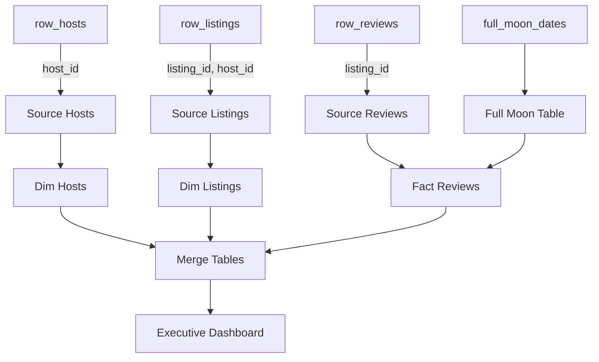

# Models Documentation

## Overview
This folder contains dbt models for transforming raw Airbnb data into source, dimension, fact, and merge tables. Models are written in SQL and organized by their purpose in the data pipeline.

---

## Data Lineage & Flow

---

## Folder Structure
- `example/` contains sample models and schema files.
- Each model transforms raw data into a specific layer (source, dimension, fact, merge).

---

## Expandable Model Documentation

my_first_dbt_model.sql

Transforms raw listings data into a cleaned source or dimension table. See SQL logic in `example/my_first_dbt_model.sql`.

my_second_dbt_model.sql

Aggregates or further transforms listings data for analytics. See SQL logic in `example/my_second_dbt_model.sql`.

schema.yml

Defines tests and documentation for models. See `example/schema.yml` for details.

---

## Best Practices
- Organize models by layer (raw, source, dimension, fact, merge).
- Document and test all models for reliability.
- Use dbt materializations (view, table, incremental, ephemeral) as appropriate.
