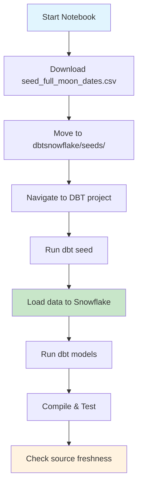

# Seeds Directory

This directory contains the Jupyter notebook for downloading and managing DBT seed data.

## Overview

The `cmd.ipynb` notebook automates the process of downloading seed data from external sources and loading it into the DBT project for use in transformations.

## Files

- `cmd.ipynb` - Jupyter notebook for seed data operations
- Full moon dates seed data (downloaded automatically)

## Workflow

## Usage

1. Open `cmd.ipynb` in Jupyter
2. Run all cells to:
   - Download seed data from S3
   - Load into DBT seeds directory
   - Execute DBT seed command
   - Run transformations

## Seed Data

- **seed_full_moon_dates.csv**: Contains full moon dates used for analyzing review patterns during lunar cycles
- Loaded into `DEV.seed_full_moon_dates` table in Snowflake
- Used by `mart_fullmoon_reviews` model for correlation analysis